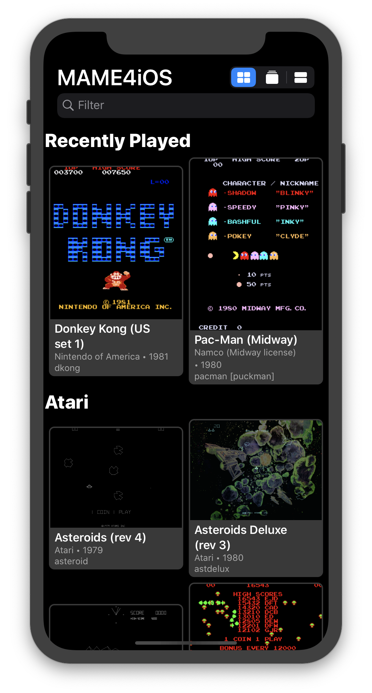
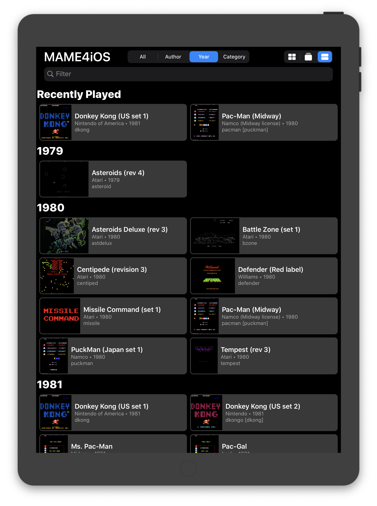
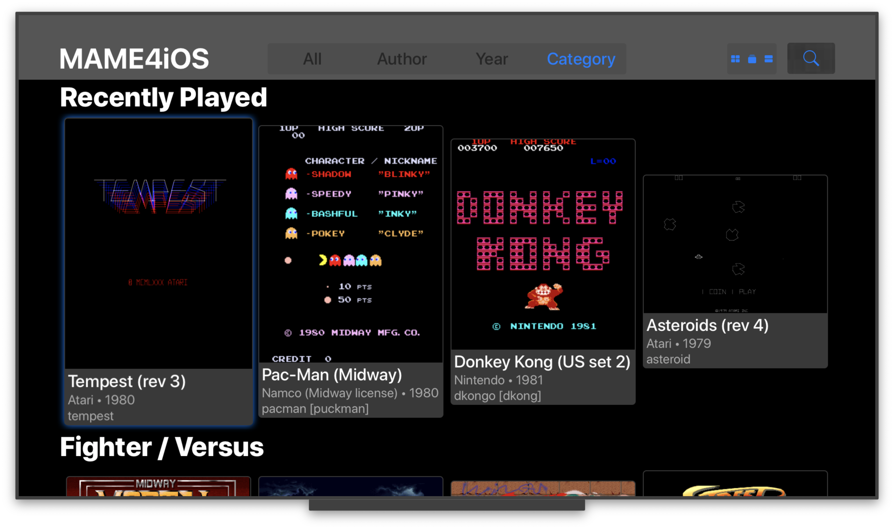
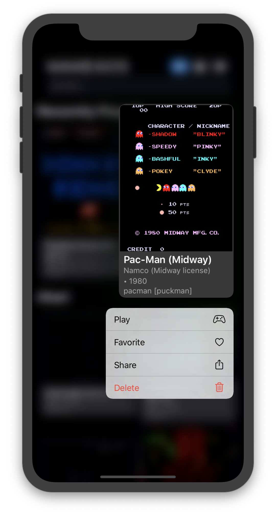
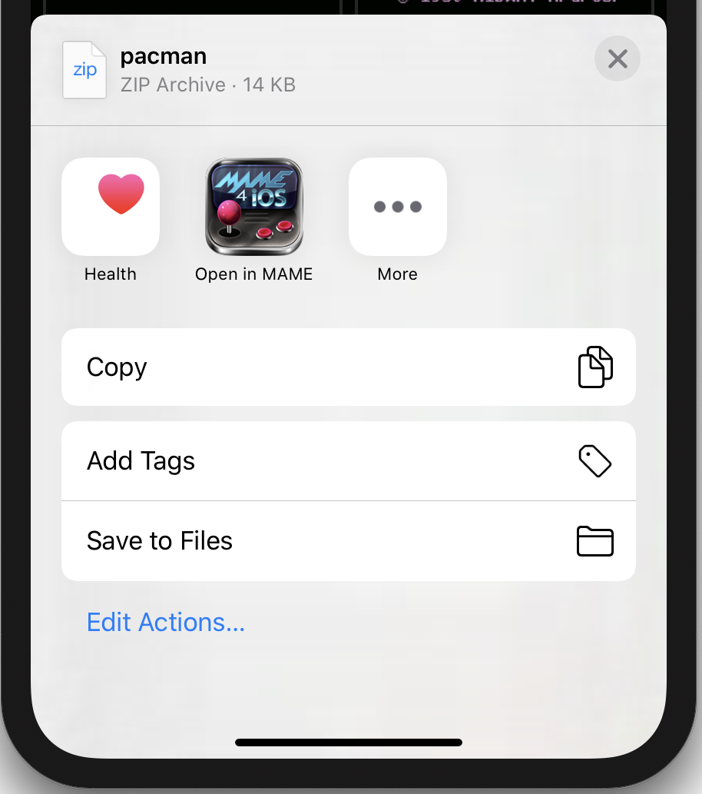

# MAME4iOS Fork
This is a fork of [yoshisuga/MAME4iOS](https://github.com/yoshisuga/MAME4iOS) by [@ToddLa](mailto:ToddLa@HotMail.com)  see the [original README](#MAME4iOS) below.

## This fork adds support for
* Updated to Xcode 11 and iOS 13
* builds (mostly) without warnings or deprecations.
* Better on screen control layout for iPhone11, iPad Pro
* [New Choose Game UI](#Choose-Game-UI)
* Rembers last game(s) played, and set of Favorite games.
* [navigate/dismiss iOS alerts with game controller or iCade](#Game-Controllers)
* [Hardware keyboard support](#hardware-keyboard)
* [Siri Remote](#Siri-Remote)
* [Xbox and DualShock controllers](#Game-Controllers)
* [8BitDo Zero](#8BitDo-Zero)
* Hide touch controlls when using joystick, iCade, or keyboard.
* [Siri Shortcuts and custom URL scheme](#Siri-Shortcuts-and-custom-URL-scheme)
* [Click and hold for a iOS 13 Context Menu](#Context-Menu)
* [Open ZIP files from other apps](#Open-in-MAME)

## TODO
* Convert project to use ARC and Modern-Objective-C
* Handle adding multiple ROMs at once in a zip of zips (aka "ROMS.ZIP")
* Handle adding a artwork zip file (move zip file with a .lay file into artwork folder)
* Add a TopShelf to tvOS (show Favorites and Recent games)
* Update help.html and update to current mappings and info.
* When multiple game controllers (siri remote) are detected, make the controller that pressed START the default controller.
* Better 2 Player support, add easy/discoverable way to do a 2 Player start. maybe add "Player 2 Start" to MAME4iOS menu.
* load and save state apears broken, remove from the MAME4iOS menu, or fix.
* remove game filter options from Settings UI (it is now native in Choose Game UI)
* add a "Fullscreen when using joystick or keyboard" option in Settings UI.

## Choose Game UI
no need to use the text mode "DOS" MAME UI to select a game, a iOS native (UICollectionView based) UI is all new.

## Hardware keyboard

handle input from a hardware keyboard, the following are examples of hardware keyboards.

* a USB or Bluetooth keyboard connected to a iOS device or AppleTV
* Apple Smart Keyboard connected to an iPad
* macOS keyboard when debugging in Xcode simulator

we suppoprt a small subset of the keys supported by the command line MAME.

     ARROW KEYS      - emulate a dpad or joystick
     LEFT CONTROL    - A
     LEFT OPTION/ALT - B
     SPACE           - Y
     LEFT SHIFT      - X
     LEFT CMD        - L1
     RIGHT CMD       - R1

     1               - Player 1 START
     2               - Player 2 START
     5               - Player 1 COIN
     6               - Player 2 COIN

     TAB             - MAME UI MENU
     ESC             - MAME UI EXIT
     RETURN          - MAME UI SELECT    (aka A)
     DELETE          - MAME UI BACK      (aka B)
     
     BQUOTE          - MAME4iOS MENU

## 8BitDo Zero 

added support for the [8BitDo Zero](https://www.8bitdo.com/zero2/) when in KEYBOARD mode.

## Siri Remote
MAME4iOS is now usable on a AppleTV using only the stock Siri Remote. You can only play games that use only the A and X buttons.

to start playing a game, hit MENU and select "Coin + Start" from the list.

    TRACKPAD MOVE   - emulate a dpad or joystick
    TRAKPAD CLICK   - A button
    PLAY            - X button
    MENU            - bring up the MAME4iOS menu

## Game Controllers

  

* supports new controller types on iOS 13
* new buttons (MENU, OPTIONS) on iOS 13+
* you can now navigate a iOS Alert using a Game Controller.
  - dpad up/down will move the current selection
  - A - select the currently selected item.
  - B - cancel the Alert

To start playing a game using a controller, do one of the following.
* hit the OPTIONS button (this will add a Coin and Start)
* hit MENU and select "Coin + Start" from the list.
* hit MENU while holding L1 to add a Coin, then hit MENU while holding R1 to Start.

## MENU/OPTION button on game controllers

NOTE because UIAlertController now works with a game controller, we dont need to rely on these crazy button combinations, but they still work, but I had to change them around a little bit so just hitting menu by itself will bring up the MAME4iOS menu.

                    NEW                   OLD
                    -------------         -------------
           MENU   = MAME4iOS MENU         START
      L1 + MENU   = COIN/SELECT           COIN/SELECT
      R1 + MENU   = START                 MAME MENU
      X  + MENU   = EXIT GAME             EXIT GAME
      B  + MENU   = MAME MENU             MAME4iOS MENU
      A  + MENU   = LOAD STATE            LOAD STATE
      Y  + MENU   = SAVE STATE            SAVE STATE

         OPTION   = COIN + START

## Siri Shortcuts and custom URL scheme

MAME4iOS will tell Siri each time you start a game, then later you can re-launch MAME4iOS via Siri or the lock screen and re-open that game.

You can also open a custom URL to launch MAME4iOS and launch a game.

    mame4iOS://name-of-game
    mame4iOS://dkong
    mame4iOS://pacman

## Context Menu

Press and hold on a game tile will bring up a iOS 13+ context menu. 

    PLAY        - Run MAME with this game.
    FAVORITE    - Add or remove this game from list of Favorites
    SHARE       - Share this game ROM file.
    DELETE      - Delete this game from the ROMS folder.

## Open in MAME

------------------------------------------------------------------------

# MAME4iOS

Original Author: David Valdeita (Seleuco) 

This is a port of MAME 0.139u1 for iOS and tvOS.

[Chat on Discord!](https://discord.gg/ZC6wkmU)

MAME stands for Multi Arcade Machine Emulator, and lets you play arcade games from the past 30+ years on a device that fits in your pocket! My teenage self from decades ago would be replaying that ["mind blown GIF"](https://media0.giphy.com/media/xT0xeJpnrWC4XWblEk/giphy.gif) over and over again, but that GIF did not exist back then.

More than 2000 games are supported, and the currently supported romset version is MAME 0.139u1 (September 2010).

It has been updated to compile and runs on Xcode 10/iOS 9+ by [Les Bird](http://www.lesbird.com/iMame4All/iMame4All_Xcode.html), and he has graciously added support for MFI Controllers.

This repo adds support for:

- 64-bit binary to run on modern and future iOS devices
- Supports modern device screen sizes, including iPhone X/XR/XS/XS Max and iPad Pro
- tvOS (new in 2019!)
- An in-app web server to transfer files from your computer (new in 2019!)
- Multiple MFI controllers (up to 4 with dual analog support - @DarrenBranford)
- Supports using the touch screen as a lightgun
- Turbo mode toggle for buttons
- Touch analog for games like Arkanoid
- Builds in Xcode 11, runs on latest iOS 13 version

## Installation / Sideloading

### Xcode

Requirements: Mac 10.13.6 with Xcode 10 or above

Building MAME4iOS requires a prebuilt MAME binary (It was not included in this repo due to its large size):

1. _Make sure you have the latest version of the Xcode commandline tools installed:_ 
`xcode-select --install`

2. In Terminal: `cd [path to MAME4iOS root]` 
  (alternatively, you can drag & drop a folder on Terminal after `cd` if don't know how to get the directory path) 

3. Get MAME binary (build yourself):
    - Build (choose one of the following depending on your device):
        - iOS 64-bit: `./make-ios.sh` 
        For iPhone 5S, iPad Air, iPad mini, and up… 
        - tvOS: `./make-tvos.sh` 
        AppleTV (4/4k and above)
        - simulator: `./make-sim.sh` 
        iOS/tvOS (version 10.0 and above)

4. Choose the appropriate build target in Xcode:
    - `MAME4iOS 64-bit Release` (iPhone/iPad)
    - `MAME tvOS Release` (AppleTV)

Even if you are not in the paid Apple Developer Program, you can sideload the app using a Mac with Xcode.

1. Open the Xcode project in `xcode/MAME4iOS/MAME4iOS.xcodeproj` 
    Make sure you have the `libmamearm64.a` (or `libmamearm64-tvos.a`) file in the root of your project. 
2. Build:
    1. If you are a developer: Build and `▶︎` Run on your device. _Done._
    2. If you are not a developer…
        1. `File` → `Preferences` add your Apple ID, select your Personal Team, and create an iOS Development Profile.
        2. Select the project name on the left pane and make sure your personal team is selected
        3. Hit the `▶︎` Run button to install on your device. _Done._

## tvOS

MAME for tvOS support was just added in early 2019, and it currently can run games, but UI support and controller support is still in-progress. Most notably:

- MFI controller is currently **required**
- No Siri-remote-as-game-controller support yet

## Using MAME

When you start MAME, you are presented with the default MAME UI, which is pretty utilitarian and is far from following the Apple Human User Interface Guidelines. But you're not here to nominate Design Awards, you're here to relive some memories!

### MAME UI Controls

- Onscreen D-Pad or MFI Controller D-Pad: Move through the menu
- A Button: Start Game
- X Button: Open Game Sub-menu: Add to Favorites or Remove Game
- Y Button: Open the Settings menu (Apple TV only)

### In-Game

- Coin + Start together: Open MAME in-game menu for input remapping
- Option: Open the Settings menu
- Exit: Exit the game

## Adding ROMs to MAME

### iOS

For iOS users, you can download ROMs using Safari and save them to the `roms` directory by choosing the "Save to Files" (go to "On My iPhone" -> MAME4iOS) option after downloading a ROM. You can also use a third party program like iExplorer or iFunBox to transfer ROMs to the MAME4iOS app directory.

You can also use the "Upload Files" option in the menu (from the options button or pressing Y + Menu in-game) to start the webserver, and enter the address shown on the web browser on your computer.

### tvOS

You can upload ROMs to MAME on your AppleTV using a computer. After MAME starts, you'll be shown a welcome screen with the address of the AppleTV that you can enter in your web browser. Add MAME ROMs to the `roms` directory using the provided web uploader.

## MFI Controller Support

Pair your MFI controller with your iOS device, and it should 'just work'.
Up to 4 MFI controllers are supported.

### Hotkey combinations (while in-game)

The following hotkey combinations are supported:

- Start game (MENU)
- Insert coin (Hold L and press MENU)
- Open MAME menu for input remapping, cheats, etc. (Hold R and press MENU)
- Open app menu for settings, save states (Hold Y and press MENU)
- Exit game (Hold X and press MENU)

### Dual analog support

The right stick on the extended controller profile is fully supported, with support for 4 players (thank you @DarrenBranford!)

### Trigger buttons

The trigger buttons are mapped to analog controls and should be useful in assigning for pedal controls, for example.

## Touch Screen Lightgun Support (new in 2018)

You can now use the touch screen for lightgun games like Operation Wolf and Lethal Enforcers. Holding down your finger simulates holding down the trigger, which is mapped to the "X" button. Tap with 2 fingers for the secondary fire, or the "B" button.

In full screen landscape mode, you can hide the onscreen controls using the "D-Pad" button at the top of the screen. When using a game controller, the top button of the screen opens the menu to load/save state or access settings.

Touch Lightgun setup is in Settings -> Input -> Touch Lightgun, where you can disable it altogether, or use tapping the bottom of the screen to simulate shooting offscreen (for game that make you reload like Lethal Enforcers).

#### Shortcuts while in Touch Screen Lightgun mode

- Touch with 2 fingers: secondary fire ("B" button)
- Touch with 3 fingers: press start button
- Touch with 4 fingers: insert coin

## Turbo Mode Toggle for Buttons (new in 2018)

Under Settings -> Game Input, there's a section called "Turbo Mode Toggle", that lets you turn on turbo firing for individual buttons. Holding down the button causes the button to fire in turbo mode.

## Touch Analog Mode (new in 2019)

Also in Settings -> Game Input, you'll find a section called "Touch Analog" and "Touch Directional Input". "Touch Analog" lets you use your touchscreen as an analog device for games using input controls such as trackballs and knobs. These include games like Arkanoid or Crystal Castles. You can adjust the sensitivity of the analog controls, and also choose to hide the d-pad/analog stick in this mode.

"Touch Directional Input" is rather experimental and is for vertical shooters so you can move around using your finger. It still needs some work so just a word of caution :)

