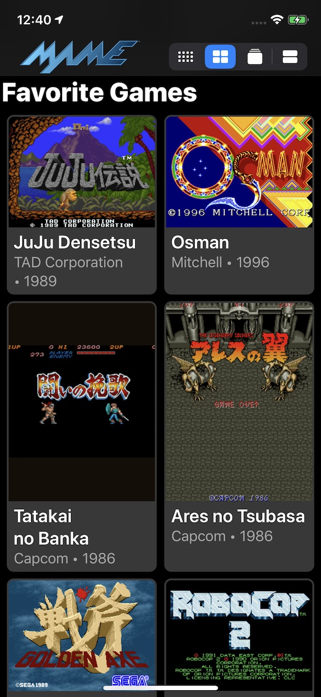
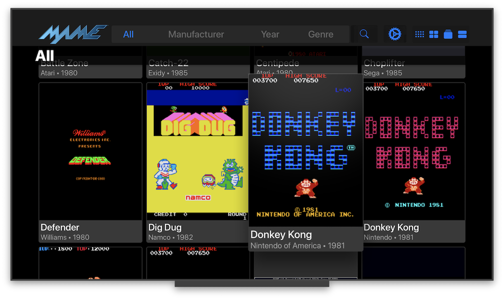
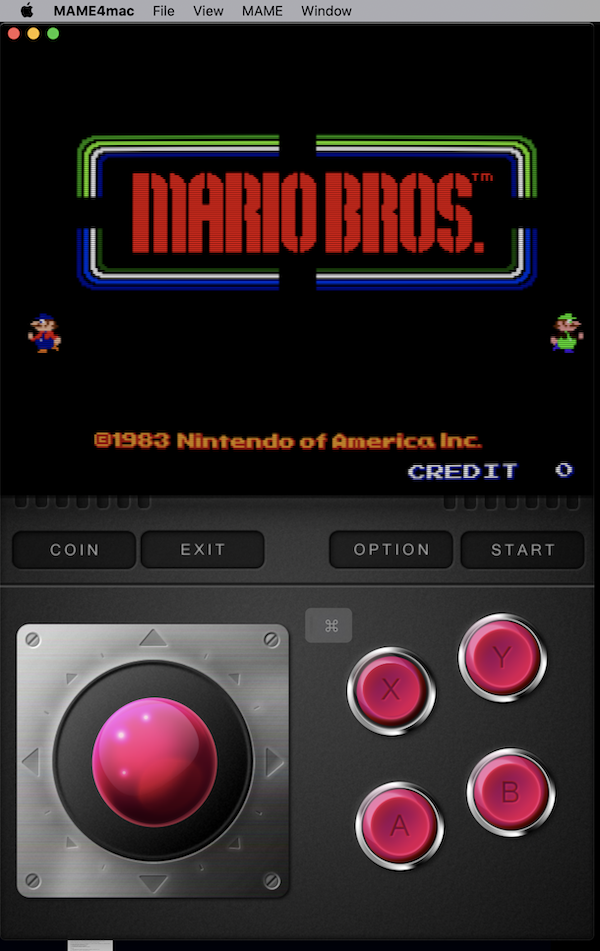

# MAME4iOS

Original Author: David Valdeita (Seleuco)  

This is a port of MAME 0.139u1 for iOS 12+, iPadOS 12+, tvOS 12+ and on both macOS Catalina & Big Sur using Mac Catalyst.

[Download IPAs for iOS and tvOS here](https://github.com/yoshisuga/MAME4iOS/releases)

[Chat on Discord!](https://discord.gg/ZC6wkmU)

[See what's new](WHATSNEW.md)

## Screenshots





## Summary

MAME stands for Multi Arcade Machine Emulator, and lets you play arcade games from the past 30+ years on a device that fits in your pocket! My teenage self from decades ago would be replaying that ["mind blown GIF"](https://media0.giphy.com/media/xT0xeJpnrWC4XWblEk/giphy.gif) over and over again, but that GIF did not exist back then.

More than 2000 games are supported, and the currently supported romset version is MAME 0.139u1 (September 2010).

It has been updated to compile and runs on Xcode 10+/iOS/tvOS 9+ by [Les Bird](http://www.lesbird.com/iMame4All/iMame4All_Xcode.html), and he has graciously added support for MFI Controllers.

This repo adds additional support for:

- 64-bit binary to run on modern and future iOS devices
- Supports modern device screen sizes, including iPhone X/XR/XS/XS Max and iPad Pro
- A native iOS/iPadOS/tvOS frontend (by @ToddLa, new in 2020!)
- A native Metal rendering engine (by @ToddLa, new in 2020!)
- tvOS support (new in 2019!)
- An in-app web server to transfer files from your computer (new in 2019!)
- Transfer ROMs, Artwork, and ROMSETs via AirDrop or iOS File Sharing (new in 2020!)
- Multiple MFI controllers (up to 4 with dual analog support - @DarrenBranford)
- Supports using the touch screen as a lightgun
- Turbo mode toggle for buttons
- Touch analog for games like Arkanoid
- Builds in Xcode 11.x/12.x and runs on latest iOS 13/14 versions

## Installation / Sideloading

### Xcode

Requirements: iOS 12.2 or higher, tvOS 12.4 or higher, or Mac 10.15 (Catalina) or higher to run.

Requirements: Mac 10.13.6 with Xcode 10 or above to bulid.

Building MAME4iOS requires a prebuilt MAME binary (it has not been included in this repo due to its large size):

1. Make sure you have the latest version of the Xcode commandline tools installed:  
`xcode-select --install`

2. In Terminal: `cd [path to MAME4iOS root]`  
  <sup>(alternatively, you can drag & drop a folder on Terminal after `cd` if don't know how to get the directory path)</sup><br>

3. Create the needed MAME binary by building it yourself from scratch: <br>
    *** FOR CATALINA USERS, IN THE SECURITY & PRIVACY SETTINGS, PLEASE ALLOW "TERMINAL" "TO RUN SOFTWARE LOCALLY THAT DOES NOT MEET THE SYSTEMS SECURITY POLICY" IN THE DEVELOPER TOOLS CATEGORY ON THE PRIVACY PAGE IN ORDER TO COMPLETE A SUCCESFUL BUILD *** <br>
- Build it in the above selected terminal by chosing one of the following scripts (depending on which device you are building for):<br>
        - iOS 64-bit: `./make-ios.sh`<br>
        <sup>For iPhone 5S, iPad Air, iPad mini, and up…</sup><br>
        - tvOS: `./make-tvos.sh`<br>
        <sup>AppleTV (4/4k and above)</sup><br>
        - simulator: `./make-sim.sh`<br>
        <sup>iOS/tvOS (version 12.4 and above)</sup><br>
        - macOS: `./make-mac.sh`<br>
        <sup>macOS(version 10.15 Catalina and above)</sup><br>
        
4. Set the Organization and Team Identifer in `xcode/MAME4iOS/MAME4iOS.xcconfig`
```
ORG_IDENTIFIER              = com.example    // CHANGE this to your Organization Identifier.
DEVELOPMENT_TEAM            = ABC8675309     // CHANGE this to your Team ID. (or select in Xcode project editor)
```
**NOTE** if you dont want a build with entitlements, comment out the `CODE_SIGN_ENTITLEMENTS` line in `MAME4iOS.xcconfig`
**NOTE** you can also set the Development Team in the Xcode project editor
    - Select the Project (not one of the targets)
    - Select the `Build Settings` tab.
    - Search for "Development Team" and select your team from the drop down.  
**NOTE** your `ORG_IDENTIFIER` must  of the form `XXXXX.YYYYY` and be unique, if you get the error `Failed to register bundle identifier` try a different one.  
**NOTE** you can find your TeamID [here](https://developer.apple.com/account/#/membership)  

5. Choose the appropriate build target in Xcode:
    - `MAME4iOS` (iPhone/iPad)
    - `MAME4tvOS` (AppleTV)
    - `MAME4mac` (Mac Catalyst)

Even if you are not in the paid Apple Developer Program, you can sideload the app using a Mac with Xcode.

1. Open the Xcode project in `xcode/MAME4iOS/MAME4iOS.xcodeproj`<br>
    <sup>Make sure you have the `libmamearm64.a` (or `libmamearm64-tvos.a`) file in the root of your project.</sup><br>
2. Build:
    1. If you are a developer: Build and `▶︎` Run on your device. _Done._
    2. If you are not a developer…
        1. `File` → `Preferences` add your Apple ID, select your Personal Team, and create an iOS Development Profile.
        2. Select the project name on the left pane and make sure your personal team is selected
        3. Hit the `▶︎` Run button to install on your device. _Done._
        
### iOS Widget and tvOS TopShelf.
To enable the iOS 14 Widget and the tvOS TopShelf extension, you must enable a [App Group Entitlement](https://developer.apple.com/documentation/bundleresources/entitlements/com_apple_security_application-groups)

Make sure the name of the App Group is `group.<ORG_IDENTIFIER>.mame4ios` 

If your `ORG_IDENTIFIER` is `com.example` you should register a AppGroup named `group.com.example.mame4ios`

### iCloud Import and Export.
* To enable syncing with iCloud, you must enable [CloudKit](https://developer.apple.com/library/archive/documentation/DataManagement/Conceptual/CloudKitQuickStart/EnablingiCloudandConfiguringCloudKit/EnablingiCloudandConfiguringCloudKit.html)
* Use the container `iCloud.<ORG_IDENTIFIER>.mame4ios`

## tvOS

MAME for tvOS support was added in early 2019, and it currently can run games has full native UI support and MFI controller support with most notably:

- MFI controllers, Xbox One, PS4 DualShock, and Siri Remote suppor.

## Using MAME

When you start MAME4iOS, you are now presented with an updated and native iOS/tvOS MAME UI

### MAME UI Controls

- Onscreen D-Pad or MFI Controller D-Pad: Move through the menu
- A Button: Start Game
- X Button: Open Game Sub-menu: Add to Favorites or Remove Game
- Y Button: Open the Settings menu (Apple TV only)

### In-Game

- Coin + Start together: Open MAME in-game menu for input remapping
- Option: Open the Settings menu
- Exit: Exit the game

## Adding ROMs to MAME

### iOS

For iOS users, you can download ROMs using Safari and save them to the `roms` directory by choosing the "Save to Files" (go to "On My iPhone" -> MAME4iOS) option after downloading a ROM. 

You can also use the "Start Server" option in the menu (from the options button or pressing Y + Menu in-game) to start the webserver, and enter the address shown on the web browser on your computer.

Yoiu can also use the "Import ROMs" option to open up the native iOS file browser and load files that are saved locally or that exist on iCloud.

### tvOS

You can upload ROMs to MAME on your AppleTV using a computer. After MAME starts, you'll be shown a welcome screen with the address of the AppleTV that you can enter in your web browser. Add MAME ROMs to the `roms` directory using the provided web uploader.

## Game Controller Support

Pair your MFI, Xbox, or Dual Shock controller with your iOS device, and it should 'just work'.
Up to 4 controllers are supported.

### Hotkey combinations (while in-game)

The following hotkey combinations are supported:

| | |  
---------------- |-------------
MENU             |Open MAME4iOS MENU   
MENU+L1       |Insert coin                 
MENU+R1       |Start Game               
MENU+X          |Exit Game                 
MENU+B          |Open MAME menu   
MENU+A          |Load State                
MENU+Y          |Save State                
OPTION            |Insert Coin and Start   

### Dual analog support

The right stick on the extended controller profile is fully supported, with support for 4 players (thank you @DarrenBranford!)

### Trigger buttons

The trigger buttons are mapped to analog controls and should be useful in assigning for pedal controls, for example.

## Siri Remote
MAME4iOS is now usable on a AppleTV using only the stock Siri Remote. You can only play games that use only the A and X buttons.

to start playing a game, hit MENU and select "Coin + Start" from the list.

    TRACKPAD MOVE   - emulate a dpad or joystick
    TRAKPAD CLICK   - A button
    PLAY            - X button
    MENU            - bring up the MAME4iOS menu

## Touch Screen Lightgun Support (new in 2018, iOS only)

You can now use the touch screen for lightgun games like Operation Wolf and Lethal Enforcers. Holding down your finger simulates holding down the trigger, which is mapped to the "X" button. Tap with 2 fingers for the secondary fire, or the "B" button.

In full screen landscape mode, you can hide the onscreen controls using the "D-Pad" button at the top of the screen. When using a game controller, the top button of the screen opens the menu to load/save state or access settings.

Touch Lightgun setup is in Settings -> Input -> Touch Lightgun, where you can disable it altogether, or use tapping the bottom of the screen to simulate shooting offscreen (for game that make you reload like Lethal Enforcers).

#### Shortcuts while in Touch Screen Lightgun mode

- Touch with 2 fingers: secondary fire ("B" button)
- Touch with 3 fingers: press start button
- Touch with 4 fingers: insert coin

## Turbo Mode Toggle for Buttons (new in 2018)

Under Settings -> Game Input, there's a section called "Turbo Mode Toggle", that lets you turn on turbo firing for individual buttons. Holding down the button causes the button to fire in turbo mode.

## Touch Analog Mode (new in 2019, iOS only)

Also in Settings -> Game Input, you'll find a section called "Touch Analog" and "Touch Directional Input". "Touch Analog" lets you use your touchscreen as an analog device for games using input controls such as trackballs and knobs. These include games like Arkanoid or Crystal Castles. You can adjust the sensitivity of the analog controls, and also choose to hide the d-pad/analog stick in this mode.

"Touch Directional Input" is rather experimental and is for vertical shooters so you can move around using your finger. It still needs some work so just a word of caution :)

## License

MAME4iOS is distributed under the terms of the GNU General Public License, 2 (GPL-2.0).
