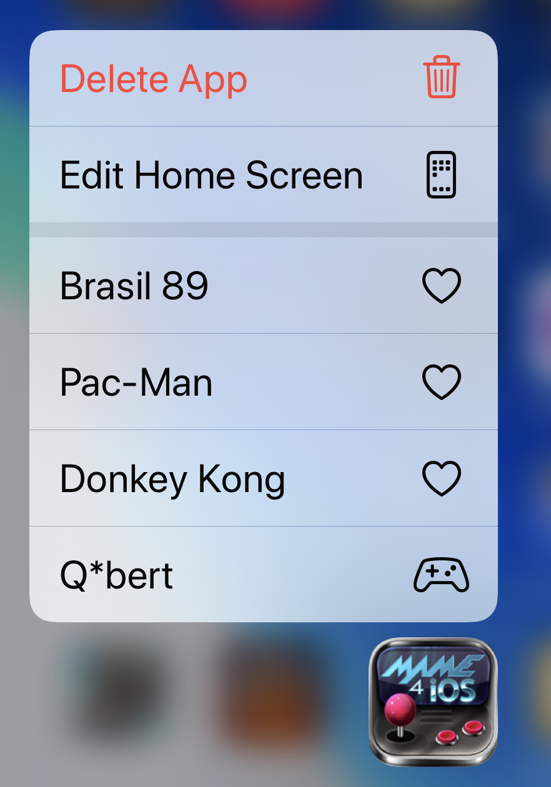

# MAME4iOS Fork
This is a fork of [yoshisuga/MAME4iOS](https://github.com/yoshisuga/MAME4iOS) by [@ToddLa](mailto:ToddLa@HotMail.com)  see the [original README](README.md) below.

## This fork adds support for
* Updated to Xcode 11 and iOS 13
* Converted project to use ARC and Modern-Objective-C
* builds (mostly) without warnings or deprecations.
* Better on screen control layout for iPhone11, iPad Pro
* [New Choose Game UI](#Choose-Game-UI)
* Rembers last game(s) played, and set of Favorite games.
* [navigate/dismiss iOS alerts with game controller or iCade](#Game-Controllers)
* [Hardware keyboard support](#hardware-keyboard)
* [Siri Remote](#Siri-Remote)
* [Xbox and DualShock controllers](#Game-Controllers)
* [8BitDo Zero](#8BitDo-Zero)
* Hide touch controlls when using joystick, iCade, or keyboard.
* [Siri Shortcuts](#Siri-Shortcuts)
* [Custom URL scheme](#Custom-URL-scheme)
* [Springboard Shortcut Menu](#Shortcut-Menu)
* [Click and hold for a iOS 13 Context Menu](#Context-Menu)
* [Open ZIP files from other apps](#Open-in-MAME)

## TODO
* Add a TopShelf to tvOS (show Favorites and Recent games)
* Update help.html and update to current mappings and info.
* When multiple game controllers (siri remote) are detected, make the controller that pressed START the default controller.
* Better 2 Player support, add easy/discoverable way to do a 2 Player start. maybe add "Player 2 Start" to MAME4iOS menu.
* load and save state apears broken, remove from the MAME4iOS menu, or fix.
* remove game filter options from Settings UI (it is now native in Choose Game UI)

## Choose Game UI
no need to use the text mode "DOS" MAME UI to select a game, a iOS native (UICollectionView based) UI is all new.

## Hardware keyboard

handle input from a hardware keyboard, the following are examples of hardware keyboards.

* a USB or Bluetooth keyboard connected to a iOS device or AppleTV
* Apple Smart Keyboard connected to an iPad
* macOS keyboard when debugging in Xcode simulator

we suppoprt a small subset of the keys supported by the command line MAME.

     ARROW KEYS      - emulate a dpad or joystick
     LEFT CONTROL    - A
     LEFT OPTION/ALT - B
     SPACE           - Y
     LEFT SHIFT      - X
     LEFT CMD        - L1
     RIGHT CMD       - R1

     1               - Player 1 START
     2               - Player 2 START
     5               - Player 1 COIN
     6               - Player 2 COIN

     TAB             - MAME UI MENU
     ESC             - MAME UI EXIT
     RETURN          - MAME UI SELECT    (aka A)
     DELETE          - MAME UI BACK      (aka B)
     
     BQUOTE          - MAME4iOS MENU
     
     CMD+ENTER       - TOGGLE FULLSCREEN
     CMD+T           - TOGGLE CRT/TV FILTER
     CMD+S           - TOGGLE SCANLINE FILTER

## 8BitDo Zero 

added support for the [8BitDo Zero](https://www.8bitdo.com/zero2/) when in KEYBOARD mode.

## Siri Remote
MAME4iOS is now usable on a AppleTV using only the stock Siri Remote. You can only play games that use only the A and X buttons.

to start playing a game, hit MENU and select "Coin + Start" from the list.

    TRACKPAD MOVE   - emulate a dpad or joystick
    TRAKPAD CLICK   - A button
    PLAY            - X button
    MENU            - bring up the MAME4iOS menu

## Game Controllers

  

* supports new controller types on iOS 13
* new buttons (MENU, OPTIONS) on iOS 13+
* you can now navigate a iOS Alert using a Game Controller.
  - dpad up/down will move the current selection
  - A - select the currently selected item.
  - B - cancel the Alert

To start playing a game using a controller, do one of the following.
* hit the OPTIONS button (this will add a Coin and Start)
* hit MENU and select "Coin + Start" from the list.
* hit MENU while holding L1 to add a Coin, then hit MENU while holding R1 to Start.

## MENU/OPTION button on game controllers

NOTE because UIAlertController now works with a game controller, we dont need to rely on these crazy button combinations, but they still work, but I had to change them around a little bit so just hitting menu by itself will bring up the MAME4iOS menu.

                    NEW                   OLD
                    -------------         -------------
           MENU   = MAME4iOS MENU         START
      L1 + MENU   = COIN/SELECT           COIN/SELECT
      R1 + MENU   = START                 MAME MENU
      X  + MENU   = EXIT GAME             EXIT GAME
      B  + MENU   = MAME MENU             MAME4iOS MENU
      A  + MENU   = LOAD STATE            LOAD STATE
      Y  + MENU   = SAVE STATE            SAVE STATE

         OPTION   = COIN + START

## Siri Shortcuts

MAME4iOS will tell Siri each time you start a game, then later you can re-launch MAME4iOS via Siri or the lock screen and re-open that game.

## Shortcut Menu

Use 3D touch (or long press) on MAME4iOS and select one of your favorite or recent games to play.

## Custom URL scheme

You can use a custom URL to launch MAME4iOS and play a game.

    mame4iOS://name-of-game
    mame4iOS://dkong
    mame4iOS://pacman

## Context Menu

Press and hold on a game tile will bring up a iOS 13+ context menu. 

    PLAY        - Run MAME with this game.
    FAVORITE    - Add or remove this game from list of Favorites
    SHARE       - Share this game ROM file.
    DELETE      - Delete this game from the ROMS folder.

## Open in MAME

Use iOS file sharing to import ROMs, ARTWORK, and multiple ROMs at once (ZIP of ZIPs).

