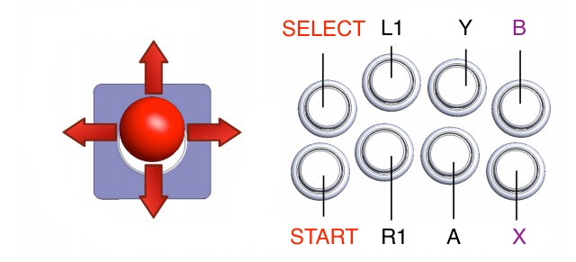

# MAME4iOS Reloaded
### Version $(APP_VERSION) ($(APP_DATE)) 
### MAME (0.139u1 )  by David Valdeita (Seleuco)

## INTRODUCTION

MAME4iOS Reloaded is developed by David Valdeita (Seleuco), port of MAME 0.139u1 emulator by Nicola Salmoria and [TEAM](#PORT-CREDITS).

MAME4iOS Reloaded emulates arcade games supported by original MAME 0.139u1.

This MAME4iOS version is targeted at 64bit devies (A7 or higher, iPhone 5s or later) , because it is based on a high specs 2010 PC MAME build. Anyway don't expect arcade games of the 90 to work at full speed. Some games are really bad optimized (like outrun or mk series). This is related to MAME build used, since it is targeted to high specs PC's as i said before. This version doesn't have an UML backend ARM dynamic recompiler, which means drivers based on high specs arcade CPUs won't be playable (it has not sense since this games will be slow in any case).

**TIP** You can try to use speed hacks from the `MAME Configure` menu to make playables some games like CPS3 ones.

Said that, with a low end device, use at your own risk. I suggest you use iMAME4all (0.37b5) instead. Remember that games that can be emulated on both versions will run much faster on iMAME4all (0.37b5) than on MAME4iOS Reloaded (0.139u1), and will drain less battery.

This version emulates over 8000 different romsets.

Please, try to understand that that with that amount of games, some will run better than others and some might not even run with MAME4iOS Reloaded. Please, don't email me asking for a specific game to run.

After installing, place your MAME-titled zipped roms in `/roms` folder, use iTunes file sharing, built in WebServer or AirDrop (select Open in MAME4iOS).

MAME4iOS Reloaded uses only '0.139u1' romset.

Official [web page](https://github.com/yoshisuga/MAME4iOS) for news, source code & additional information:

To see [MAME license](#MAME4iOS-LICENSE), go to the end of this document.

## Features

*   Autorotate.
*   Smoothed image.
*   Scanline & TV Effect.
*   Full screen, windowed.
*   Selectable animated touch DPad, Digital Stick or Analog Stick.
*   1/6 touch buttons selectable.
*   External controller support: [iCade (or compatible)](#icade_or_compatible), iControlPad, iMpulse (1 or 2 Players).]
*   [Hardware keyboard](#hardware-keyboard)
*   MiFI, Xbox, and DualShock [Game Controlers](#game-controlers)
*   [TV-OUT](#tv-out)
*   [iCloud Import, Export, and Sync.](#iCloud)

... and more.

## CONTROLS

The emulator controls are the following ones:

**Virtual pad** Movement in pad, mouse and analog control of the four players.

**Buttons B,X,A,Y,L,R** Buttons A,B,C,D,E,F.

**Buttons START+COIN** (pressed simultaneously) Access to the MAME menu.

**Button COIN** Insert credits (UP+COIN = 2P credits, RIGHT+COIN = 3P credits, DOWN+COIN = 4P credits).

**Button START** Start (UP+START = 2P start, RIGHT+START = 3P start, DOWN+START = 4P start).

**Button EXIT** Exit to selection menu to select another game.

**Button MENU** Open MAME4iOS menu, global settings.

**NOTE** To type OK when MAME requires it, press LEFT and then RIGHT.

## GLOBAL OPTIONS

**FIlter** the method used to expand the emulator screen.
- **Nearest** Dont appy any filtering, aka `FatBits`
- **Linear**  Apply a smoothing image filter over the emulator screen.

**Skin** choose the artwork and layout of the onscreen controlls. 
- **Default** - the default MAME4iOS look.
- **Light Border** - Default + a bright thick border
- **Dark Border** - Default + a think dark border
- **Classic** - the old MAME4iOS look.

**Screen Shader**  effect to apply to the emulator screen. 
- **None** dont use any effect.
- **Default** use the default `simpleTron`.
- **simpleTron** simple CRT effect.
- **megaTron** more advanced CRT effect.
- **ulTron** even more advanced CRT effect.

**Vector Shader** effect to apply to vector games. 
- **None** dont use any effect.
- **Default** use the default `lineTron`.
- **lineTron** simple vector effect with fade out.

**Full Screen** Uses all available screen or shows the emulator windowed.

**Full Screen with Controler** automaticly enters Full Screen when a controler, keyboard, iCade is detected.

**Keep Aspect Ratio** 'Enabled' keeps the aspect ratio; 'Disabled' will use all available screen.

**Integer Scaling Only** 'Enabled' will only scale image by integer amounts.

**Change Current Layout** Changes the current touch controller current layout.

**Reset Current Layout to Default** Restores the current layout.

**Animated** Animates ON/OFF DPad/Stick. Disable to gain performance.

**Touch Type** Set the touch stick to works as analog stick, digital stick or dpad.

**Stick Type** Limits the joystick's range of motion: 8-way,4-way,2-way The most common reason to use a gate in an actual arcade setting is the retrofitting of an older machine that is not compatible with a new 8-way stick. A classic example of this is Pac-Man. The game was originally designed for a 4-way stick, and is programmed to respond only when a new input occurs. If the user is holding the stick in the down position, then suddenly makes a motion to move to the right, what often happens is that the stick first moves into the down-right diagonal, which the game does not recognize as new input since down is still being held. However, right is also now considered held, and when the user completes the motion to move right, it is also not a new input, and Pac-Man will still be moving down.

**Full Screen Buttons** Show 1-4/6 Buttons: Hide/show B/Y/A/X/L/R buttons if needed.

**Button A = B + X** Select it to use A button as B and X simultaneous press.

**Buttons Size** Lets you change the touch buttons size.

**Fullscreen Stick Size** Lets you change the stick size (not DPAD) on lanscape or portrait fullscreen mode.

**Nintendo Button Layout** if enabled the 🅐 🅑 and 🅧 🅨 buttons will be swapped to match a Nintendo layout.  This option has no effect on a physical game controller.

**External Controller** Enable external controller: iCade, iControlPad as iCade mode or iMpulse.

**P4,P3,P2 as P1** Send Player 1 input data to Player2,3,4 so you can use the 2-4 players at the same time. Funny :). It makes some weird problems with some roms like D&D.

**Button B as Autofire** If enabled, press B to switch autofire on/off.

**DPAD Touch DZ** Enable/Disable a deadzone on DPAD touch center. It could be better for some games. Disable if you don't like it.

**Stick Touch DZ** Touch stick deadzone selector. Lower to gets more sensitivity.

**Sound** Enable or set the default sound rate for games.

**Cheats** Enables the reading of the cheat database, if present, and the Cheat menu in the user interface.

**Save Hiscores** If enabled, saves hiscores on some games not saving on NVRAM. It could cause problems with some games or save states.

**Show FPS** Shows ON/OFF fps.

**Force Pixel Aspect** Enable it to force pixel aspect ratio bypassing MAME video selection.

**Show Info/Warnings** Shows Game Info and any warnings when a game is selected.

## FAVORITES

You can mark (or unmark) your ROMS in the MAME4iOS game selection window as favorites by long pressing to get a context menu. 

You can mark (or unmark) your ROMS in the MAME DOS MENU by pressing the X button. A favorite ROM appears in blue in the game list. The favorites are saved to the file: Favorites.ini. This file is compatible with the standard MAME Favorites.ini file format so you can copy this over from your PC version of MAME to the iOS version.

## RESET
when you make a mistake and need to undo

### Global Settings Reset (aka Factory Reset)
`Settings` > `Reset to Defaults`
* restore all MAME4iOS settings to default.
* delete Recent and Favorite games.
* delete all cached Title Images. 
* delete all MAME key mappings or settings. 
* select `Delete all ROMs` to also remove all data.

### Per Game Settings Reset
context menu, select `Delete`, then choose `Delete Settings`. 
* delete any MAME key mappings or settings for game
* delete any hiscores
* delete any saved state.
* delete cached Title image. 

### Delete Game 
You can also remove a game totally, context menu `Delete`, choose `Delete All Files`

## iCloud
Store your favorite games in the cloud.

When MAME4iOS is built with a CloudKit entitlement you will see a new iCloud section in Settings
* **Export to iCloud** will copy all local ROM, Artwork, State files up to the *Cloud*. (Only files not already uploaded or have changed are copied)
* **Import from iCloud** will copy down files from the Cloudkit database that dont exist on device, or have been updated.
* **Sync with iCloud** will do both a Import and Export. 
* **Erase iCloud** can be used to remove all files in **iCloud**. 
**NOTE** files are *never* deleted, only ever copied. (execept for `Erase iCloud`)

## Hardware keyboard

handle input from a hardware keyboard, the following are examples of hardware keyboards.

* a USB or Bluetooth keyboard connected to a iOS device or AppleTV
* Apple Smart Keyboard connected to an iPad
* macOS keyboard when debugging in Xcode simulator

below is a list of a small subset of the keys supported by MAME4iOS, for a full list look [here](https://docs.mamedev.org/usingmame/defaultkeys.html).

| | |  
-|-
     ARROW KEYS      | emulate a dpad or joystick
     LEFT CONTROL    | 🅐 
     LEFT OPTION/ALT | 🅑
     SPACE           | 🅨
     LEFT SHIFT      | 🅧
     Z        | L1
     X       | R1
     1               | Player 1 START
     2               | Player 2 START
     5               | Player 1 COIN
     6               | Player 2 COIN
     TAB             | MAME UI MENU
     ESC             | MAME UI EXIT
     RETURN          | MAME UI SELECT (aka 🅐)

These keys are specific to `MAME4iOS`

| | |  
-|-
     ⌘+ENTER       | TOGGLE FULLSCREEN
     ⌘+I           | TOGGLE INTEGER SCALE
     ⌘+Z           | TOGGLE FPS DISPLAY
     ⌘+U           | TOGGLE HUD DISPLAY
     ⌘+F           | TOGGLE FILTER (Nearest and Linear)
     ⌘+P           | TOGGLE PAUSE
     ⌘+A                  | TOGGLE `Keep Aspect Ratio`
     ⌘+X                  | TOGGLE `Force Pixel Aspect`
     ⌘+M                  | TOGGLE `Mouse Capture`
     ⌘+1               | Player 1 COIN+START
     ⌘+2               | Player 2 COIN+START

## Game Controlers

Some of the supported game controllers include, but are not limited to:
* Xbox Wireless Controller with Bluetooth (Model 1708)
* PlayStation DUALSHOCK®4 Wireless Controller
* MFi (Made for iOS) Bluetooth controllers, like the SteelSeries Nimbus, Horipad Ultimate, and more may be supported.
* XInput compatible controllers. (Pair via Options > Accessibility > Switch Control)
* iCade
* 8BitDo M30, Zero, and others
* Steam Game Controllers
* iMpulse

To start playing a game using a controller, do one of the following.
* hit MENU and select `Coin + Start` or `1 Player Start`
* hit MENU+L1 to add a Coin, then hit MENU+R1 to Start.
* hit SELECT, then START

## Xbox Controller

| | |  
-|-
`VIEW`     |SELECT                
`GUIDE`   |MENU (on iOS 14+)  
`MENU`     |START              
`VIEW`+`MENU`|MENU

## Playstation Dualshock

| | |  
-|-
`SHARE`     |SELECT                
`PS Button`           |MENU  (iOS 14+)
`OPTIONS`     |START      
`SHARE`+`OPTIONS`|MENU

## SteelSeries Nimbus Controller (MFi)

| | |  
-|-
`MENU` or `PAUSE`           |MENU   

## Nimbus+ Controller

| | |  
-|-
`OPTIONS`     |SELECT                
`HOME`           |MENU (on iOS 14+)   
`MENU`           |START      
`OPTIONS`+`MENU`|MENU

## Steam Game Controlers

To use a Steam Controller, make sure it is updated to BLE Firmware, and it paired with iOS device, see [here](https://support.steampowered.com/kb_article.php?ref=7728-QESJ-4420).

Steam Controller Buttons

| | |  
-|-
`BACK`     |SELECT                 
`STEAM Button`           |MENU   
`START`     |START              

## MENU button on game controllers

* if your controller has a dedicated `MENU` button pressing it will bring up the in-game menu.
* if your controller only has `SELECT` and `START` you can long press either one to bring up the in-game menu, or press both at the same time.
* you can use use any of `SELECT`, `START`, or `MENU` to perform a menu action, listed below, for example both `MENU+X` and `SELECT+X` will exit the game.

## MENU combination actions

To perform a menu action do one of the following
* hold down `MENU` or `SELECT` or `START` and press the combo button. ie MENU+X
* hold down the combo button and press `MENU` or `SELECT` or `START`. ie X+MENU

| | |  
-|-
MENU+L1     |Player Coin                 
MENU+R1     |Player Start               
MENU+L2     |Player 2 Coin                
MENU+R2     |Player 2 Start               
MENU+A       |Show or hide HUD                 
MENU+B       |Pause MAME   
MENU+X       |Exit Game                 
MENU+Y       |Open MAME Configure menu   
MENU+DOWN  |Save State ①               
MENU+UP        |Load State ①                
MENU+LEFT     |Save State ②                
MENU+RIGHT  |Load State ②               

## Multiplayer game start using game controllers

You can start a multiplayer game (1,2,3 or 4) players from the MAME4iOS menu.

If a user inserts a COIN or hits START with a game controller, it will be interpeted as a COIN/START for that player.  

You can insert a COIN or do a START for another player from the main Game Controller by pressing one of the following.

| | |  
-|-
MENU+L2|Player 2 COIN
MENU+R2|Player 2 SELECT

## SAVE/LOAD STATE

You can save or load game states by pressing the MENU button when you are gaming, and select save or load state option. Also you can press button MENU+UP (Load) or MENU+DOWN (Save) on a external controller. 

## Siri Remote
MAME4iOS is now usable on a AppleTV using only the stock Siri Remote. You can only play games that use only the A and B buttons.

to start playing a game, hit `MENU` and select `1 Player Start` from the list.

| | |  
-|-
TRACKPAD MOVE   | emulate a dpad or joystick
TRAKPAD CLICK   | A button
PLAY            | B button
MENU          | bring up the MAME4iOS menu

## iCADE (or compatible)

The best way to use iCade with MAME4iOS is in fullscreen portrait mode, hit the option button and choose options. The onscreen controls will fade out when you start using the iCade buttons. Tap the screen to get MAME4iOS menu.

If the iCade is off (the fake coin slot light is off) just hit an iCade button or move the joystick.(you must have paired the iCade via bluetooth before)

Thanks to Todd Laney for sending me patches, and Martijn Bosschaart who has supported me to get the iCade HW.

## iMpulse

MAME4iOS works correctly out of the box for iMpulse, also has built-in support for local multiplayer (TwiMpulse). Anayway, if you need to redefine second player buttons, you should press coin (left shoulder button) before so MAME4iOS initializes second iMpulse controller.

## XInput Controller

If you have an XInput compatible controller, use `Settings` > `Accessibility` > `Switch Control` > `Switches` > `Bluetooth Devices` to pair controller, then use as normal in MAME4iOS.

## TV-OUT

To connect an iPad or iPhone to your TV or a projector, you can either use the Apple HDMI, Component AV Cable, Apple Composite AV Cable, Apple Dock Connector to VGA Adapter, or other compatible cable.

When the cable is connected to a TV or projector, MAME4iOS will automatically use it when playing a game.

## MANUAL ROM INSTALLATION

use iTunes file sharing (if your MAME4iOS build has it available) or use a 3rd party app like iFunBox or iExplorer to copy ROMs on sandboxed MAME4iOS 'Documents' folder:

Step 1\. Downloaded iFunBox (or a similar utility) and plug your iOS device into your computer.

Step 2\. Launch iFunBox and select your iOS device on the left hand side.

Step 3\. click on apps icon. Now you should see a list of all of your device’s applications. Locate MAME4iOS, click it, and select Documents.

Step 4\. And that’s all there is to it. Move your ROMs into this folder, launch MAME4iOS, and start playing!

## DIRECTORIES

| | |  
-|-
`artwork/` | Artwork directory
`titles/` | Title images directory
`cfg/` | MAME configuration files directory
`hi/` | Hiscores directory
`nvram/` | NVRAM files directory
`roms/ `| ROMs directory
`samples/` | Samples directory
`snap/` | Screen snapshots directory
`sta/` | Save states directory

## SUPPORTED GAMES

MAME4iOS Reloaded uses only '0.139u1' [romset](https://archive.org/details/MAME_2010_full_nonmerged_romsets).

Games have to be copied into the `roms/` folder.

## ROM NAMES

Romsets have to be MAME 0.139u1 ones (September 2010).  **NOTE** File and directory names in iOS are case-sensitive. Put all file and directory names using low case!.

## SOUND SAMPLES

The sound samples are used to get complete sound in some of the oldest games. They are placed into the 'samples' directory compressed into ZIP files. The directory and the ZIP files are named using low case!.

## ARTWORK

Starting with the release of MAME 0.107 in July 2006, thanks to Aaron Giles, MAME supports hi-resolution artwork for bezels, backdrops, overlays, marquees, control panels, instruction cards, etc., and includes a new file format for the layout (.lay)

Save these files to your MAME4iOS artwork directory, or import via AirDrop.  To use them at a higher resolution change the emulated resolution (instead of auto) in Settings. This *may* hurt performance

http://mameworld.info/mrdo/mame_artwork.php

## ORIGINAL CREDITS

MAME 0.139u1 original version by Nicola Salmoria and the MAME Team.

## PORT CREDITS

Port to iOS by David Valdeita (Seleuco)

## DEVELOPMENT

*   2020-02-26 Version 2020.1Rebirth
*   2013-04-05 Version 1.6\. Added Peer to peer netplay multiplayer over WI-FI or Bluetooth. Options menu reworked. Added Vector defaults options. Added Emulation speed and thread type options. Sixaxis fixes. Some other bug fixes.
*   2013-04-05 Version 1.5\. Added native l2cap bluetooth support for up to 4 PS3 Sixaxis controllers (you must store the Bluetooth address of your iOS device in your controller with a 3rd party utility like SixaxisPairTool). Added button and stick size selectors. Fixed permissions errors when creating files on jailbroken devices. Bluetooth manager bug fixes.
*   2013-03-17 Version 1.4\. Added in app touch layout customization. Added hiscores saving (MKChamp patch). Added switch to force 60Hz video for smoother gameplay in some games (use with caution since could broke other games like cave ones). Added autofire with different speeds. Added threaded video and thread priority switches. Fixed some anonymous timers on sega and cave drivers to fix save states problems (AWJ patch). Fixed 2nd controller mapping issues. Fixed simultaneous analog and digital input on external controllers. Added support for newer Wiimotes.
*   2013-02-09 Version 1.3.1 Minor bug fixes. Updated to Jailbroken devices.
*   2013-01-14 Version 1.3\. Added iPhone 5 support. Universal armv7+armv7s binary. Code refactoring for iOS 6\. Added game filtering (manufacturer, driver source, year, category, keyword, clones). Added favorites. Added option to delete games in rom manager. Added iTunes file sharing to upload roms. Added auto selection for 1-6 buttons & 2-8 ways stick. Added iMpulse controller support (+ TwiMpulse). Added low latency audio option. Improved rom manager. A lot of bug fixes.
*   2012-06-02 Version 1.2\. Fixed compatibility issue with iOS 5.1.1 jailbreak. Added local multiplayer (up to 4 players). Added true analog control (selectable as option). Fixed Taito X system. Added P1 Player as P2,P3,P4 input option. Some bug fixes.
*   2012-04-08 Version 1.1\. Upgraded to MAME 0.139u1\. Added 4/3, pixel aspect video aspects (now works MAME menu aspect ratio selector), improved iPad touch control layout, improved ROM manager, Added emulated resolution selector to improve artwork rendering, added configuration input menus, added missing options like frameskip.
*   2012-03-09 Version 1.0 WIP. First version.

## KNOWN PROBLEMS

-Button mapping problems: Remove cfg files or folder besides rom folder, or do a `Settings` > `Reset`.

## INTERESTING WEBPAGES ABOUT MAME

*   [http://mamedev.org](http://mamedev.org)
*   [http://www.mameworld.info/](http://www.mameworld.info/)

## ART

Retina skin and touch control layout thanks to Bryn Thompson.

## Thanks

Todd Laney for sending me iCade patches, and Martijn Bosschaart for support me with an iCade.

## MAME4iOS LICENSE

MAME4iOS is released under a dual-license (GPL / MAME license) of your choice. Under the GPL license in addition you have some extra rights granted by a special license exception which allow you to link the MAME4iOS GPL source with the not GPL MAME source. The exception also gives you the rights to eliminate it if you don't like it or if you want to include the MAME4iOS source in another GPL program. So, MAME4iOS is 100% GPL. You can more easily think at it as a sort of double license. A GPL or a GPL + exception. You have all the rights of the GPL, and, if you want, some others. The only limitation is for MAME4iOS. MAME4iOS cannot include external GPL source without the explicit permission of the source copyright holder.

## MAME LICENSE

*   [http://mamedev.org](http://mamedev.org)

Copyright 1997-2013, Nicola Salmoria and the MAME team. All rights reserved.

Redistribution and use of this code or any derivative works are permitted provided that the following conditions are met:

*   Redistributions may not be sold, nor may they be used in a commercial product or activity.
*   Redistributions that are modified from the original source must include the complete source code, including the source code for all components used by a binary built from the modified sources. However, as a special exception, the source code distributed need not include anything that is normally distributed (in either source or binary form) with the major components (compiler, kernel, and so on) of the operating system on which the executable runs, unless that component itself accompanies the executable.
*   Redistributions must reproduce the above copyright notice, this list of conditions and the following disclaimer in the documentation and/or other materials provided with the distribution.

THIS SOFTWARE IS PROVIDED BY THE COPYRIGHT HOLDERS AND CONTRIBUTORS "AS IS" AND ANY EXPRESS OR IMPLIED WARRANTIES, INCLUDING, BUT NOT LIMITED TO, THE IMPLIED WARRANTIES OF MERCHANTABILITY AND FITNESS FOR A PARTICULAR PURPOSE ARE DISCLAIMED. IN NO EVENT SHALL THE COPYRIGHT OWNER OR CONTRIBUTORS BE LIABLE FOR ANY DIRECT, INDIRECT, INCIDENTAL, SPECIAL, EXEMPLARY, OR CONSEQUENTIAL DAMAGES (INCLUDING, BUT NOT LIMITED TO, PROCUREMENT OF SUBSTITUTE GOODS OR SERVICES; LOSS OF USE, DATA, OR PROFITS; OR BUSINESS INTERRUPTION) HOWEVER CAUSED AND ON ANY THEORY OF LIABILITY, WHETHER IN CONTRACT, STRICT LIABILITY, OR TORT (INCLUDING NEGLIGENCE OR OTHERWISE) ARISING IN ANY WAY OUT OF THE USE OF THIS SOFTWARE, EVEN IF ADVISED OF THE POSSIBILITY OF SUCH DAMAGE.
